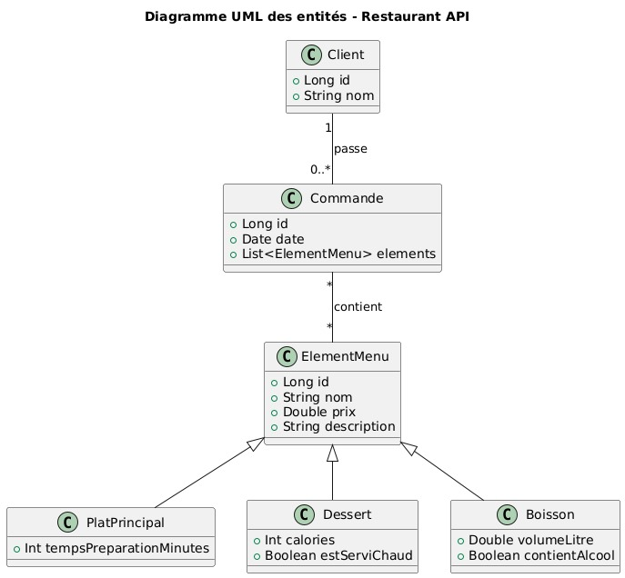

# 🍽️ Restaurant API - Projet Backend Kotlin / Spring Boot

## 📝 Description
Cette application est une **API REST** développée en **Kotlin** avec **Spring Boot** pour gérer les éléments d’un restaurant :
les plats, les boissons, les desserts, les commandes et les clients.  
Elle permet d’ajouter, modifier, supprimer et consulter les informations via des endpoints REST.

---

## 🛠️ Technologies Utilisées
- **Langage :** Kotlin
- **Framework :** Spring Boot 3
- **Base de données :** MySQL
- **Build Tool :** Gradle
- **ORM :** Spring Data JPA / Hibernate

---

## 📊 Diagramme UML


---

## 🗃️ Structure de la Base de Données
- **Client :** représente les clients du restaurant
- **Commande :** relie un client à plusieurs éléments du menu
- **ElementMenu :** classe mère (abstraite) des éléments du menu
- **PlatPrincipal :** représente les plats principaux
- **Boisson :** représente les boissons disponibles
- **Dessert :** représente les desserts proposés par le restaurant

---

## 🚀 Installation et Exécution

### 🔧 Prérequis
- JDK 17+
- MySQL installé
- Gradle

---

### 🪜 Étapes d'installation

#### 1️⃣ Cloner le repository
```bash
git clone https://github.com/aliben04/RestaurantApi.git

```
2️⃣ Créer la base de données

CREATE DATABASE restaurant_db;

3️⃣ Configurer application.properties

spring.application.name=RestaurantApi

spring.datasource.url=jdbc:mysql://localhost:3306/restaurant_db

spring.datasource.username=root

spring.datasource.password=

spring.datasource.driver-class-name=com.mysql.cj.jdbc.Driver

spring.jpa.hibernate.ddl-auto=update

spring.jpa.database-platform=org.hibernate.dialect.MySQL8Dialect

spring.jpa.show-sql=true

4️⃣ Lancer l’application

./gradlew bootRun

📡 Endpoints Disponibles
-Client:

GET /api/clients → Récupérer tous les clients

GET /api/clients/{id} → Récupérer un client par ID

POST /api/clients → Créer un nouveau client

PUT /api/clients/{id} → Mettre à jour un client

DELETE /api/clients/{id} → Supprimer un client

-Plat Principal:

GET /api/plats

GET /api/plats/{id}

POST /api/plats

PUT /api/plats/{id}

DELETE /api/plats/{id}

Dessert : 

GET /api/desserts

GET /api/desserts/{id}

POST /api/desserts

PUT /api/desserts/{id}

DELETE /api/desserts/{id}

Boisson:

GET /api/boissons

GET /api/boissons/{id}

POST /api/boissons

PUT /api/boissons/{id}

DELETE /api/boissons/{id}

Commande:
GET /api/commandes

GET /api/commandes/{id}

POST /api/commandes

PUT /api/commandes/{id}

DELETE /api/commandes/{id}

✨ Améliorations Techniques Intégrées

- Validation des données avec @Valid, @NotNull, @NotBlank, etc.

- Gestion centralisée des exceptions (@ControllerAdvice).

- Utilisation des DTOs pour séparer la couche de présentation.

👥 Auteurs:

- Ali Benettoumi & Hamza Joual

##Date : 31/10/2025